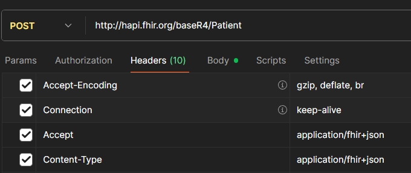
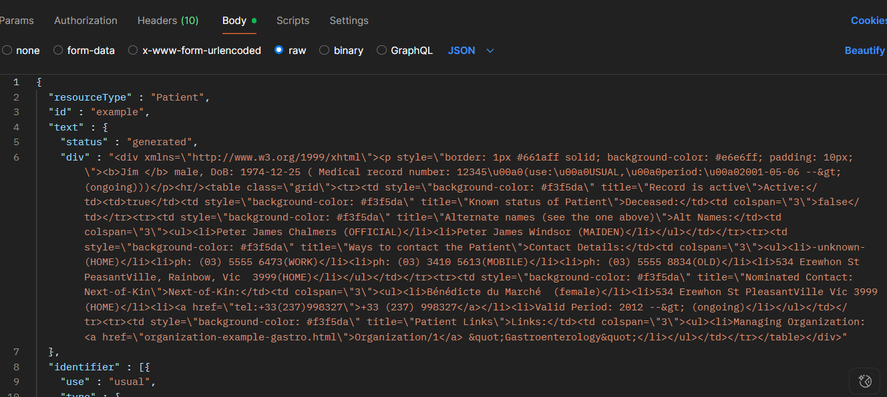
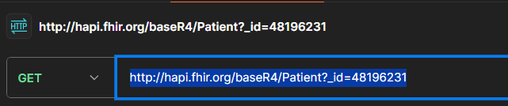
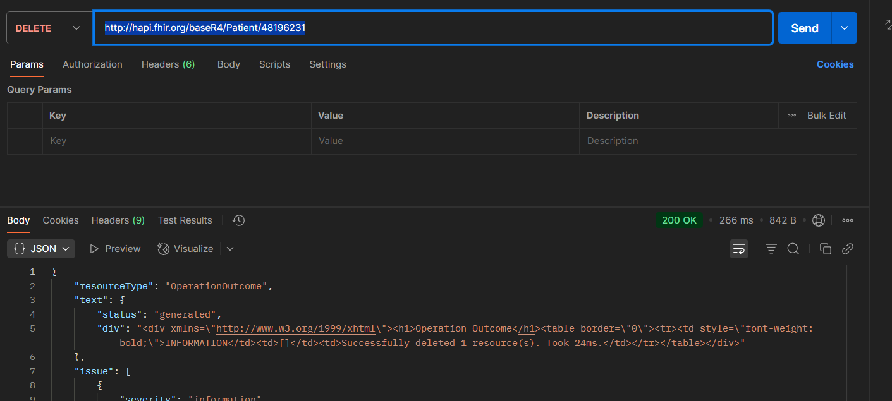

# SETUP AND DEVELOPING AN APPLICATION IN HL7-FHIR IN WINDOWS:

This is a guide document on how to start and build an **HL7-FHIR app project** in Visual Studio Code.
This application is developed in **C#**, using external **NuGet** packages to support development.

# The 1st Project

The first project will consist in communicating with the server by getting a list of patients, searching for an specific one and a getting a short and brief description about patient resources.

## Needed Tools

The developent of the app will need certain requirements.

- [**VISUAL STUDIO**](https://visualstudio.microsoft.com/)**/**[**VISUAL STUDIO CODE**](https://visualstudio.microsoft.com/)
- [**Windows Pretty Terminal**](https://www.hanselman.com/blog/how-to-make-a-pretty-prompt-in-windows-terminal-with-powerline-nerd-fonts-cascadia-code-wsl-and-ohmyposh) **(not Mandatory)**
- [**HL7-FHIR V4**](https://www.nuget.org/packages/Hl7.Fhir.R4/)
- [**GIT**](https://git-scm.com/)
- [**.NET**](https://dotnet.microsoft.com/download/dotnet-core) **(Preference Up to date)**
- [**C# XML Documentation Comments**](https://marketplace.visualstudio.com/items?itemName=k--kato.docomment)
- [**Postman**](https://www.postman.com/downloads/)

## Create and Setup the evironment

First, you need to create the folders and access the folder that you chose as your project directory.

## Create And Access the Folder:

````bash
 mkdir FhirApp
 cd FhirApp
````

## Create Project

````bash
 dotnet new console - n <NameOfProject>
 cd FhirDemo   
````

the -n option is short for --name.

It specifies the name of the project that the dotnet new command will create.

# INSTALL THE PACKAGES:

When working with HL7 standard and choosing a version of the protocol, it is not possible to run different versions in the same project, so choose one wisely and search for wich one will be better for you to chose.
In this Project we will advice using the **version R4** of Fhir.

## SETUP THE NUGETS (CHOOSE A VERSION):

### HL7-FHIR V-STU3:

```bash
- dotnet add package Hl7.Fhir.STU3 
- dotnet add package Hl7.Fhir.Specification.STU3
```

### HL7-FHIR V-R4:

```bash
 dotnet add package Hl7.Fhir.R4
 dotnet add package Hl7.Fhir.Specification.R4
```

### HL7-FHIR V-R4B:

```bash
 dotnet add package Hl7.Fhir.R4B
 dotnet add package Hl7.Fhir.Specification.R4B
```

### HL7-FHIR V-R5:

```bash
 dotnet add package Hl7.Fhir.R5 
 dotnet add package Hl7.Fhir.Specification.R5
```

### RUN THE PROJECT:

To start the project in visual run the following comand:

```bash
dotnet run --project <NameOfProject>
```

# USING POSTMAN

## Add Patient





We can also add a patient via commandline.

Pay attention these command is just and example, the Id of your patient may be  diferent..

```bash
curl --location --request POST "http://hapi.fhir.org/baseR4/Patient" \
--header "Content-Type: application/fhir+json" \
--data-raw '{
  "resourceType": "Patient",
  "name": [{
    "use": "official",
    "family": "Doe",
    "given": ["John"]
  }],
  "gender": "male",
  "birthDate": "1980-01-01"
}
```

## Cosult Patient



We can also apply these commands in the terminal, to get patients info.

Pay attention these command is just and example, the Id of your patient may be diferent..

```bash
curl --location --request GET "http://hapi.fhir.org/baseR4/Patient?_id=48196231" --header "Accept: application/fhir+json" //BACK A BUNDLE

curl --location --request GET "http://hapi.fhir.org/baseR4/Patient/48196231" --header "Accept: application/fhir+json" //BACK A PATIENT RESOURCE
```

## Delete Patient



Pay attention these command is just and example, the Id of your patient may be diferent.

```bash
 curl --location --request GET "http://hapi.fhir.org/baseR4/Patient?_id=48196231" --header "Accept: application/fhir+json" //BACK A BUNDLE

 curl --location --request GET "http://hapi.fhir.org/baseR4/Patient/48196231" --header "Accept: application/fhir+json" //BACK A PATIENT RESOURCE
```

## Update a patient:

Pay attention these command is just and example, the Id of your patient may be diferent.

```bash
curl --location --request PUT "http://hapi.fhir.org/baseR4/Patient/12345" \
--header "Content-Type: application/fhir+json" \
--data-raw '{
  "resourceType": "Patient",
  "id": "12345",
  "name": [{
    "use": "official",
    "family": "Doe",
    "given": ["Jane"]
  }],
  "gender": "female",
  "birthDate": "1990-05-20"
}'
```


The work still in progress, so for now just setup the work space.
