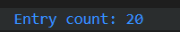

# SETTUP AND CREATING AN API CLIENT-SERVER HL7-FHIR STU3 v1.90 IN WINDOWS:

This is a guide document on how to start and build an **HL7-FHIR app project** in Visual Studio Code.
This application is developed in **C#**, using external **NuGet** packages to support development.

This project uses HL7 FHIR STU3 (R3) via the Firely .NET SDK. It connects to a public test FHIR server and fetches Patient resources.

# The 1st Project

The first project will consist in communicating with the server by getting a list of patients, searching for an specific one and a getting a short and brief description about patient resources. Testing the communication between client-server.

The project is developed in STU-3 also known as R3 of FHIR, the version of the packets provided it's 1.90.

## Needed Tools

The developent of the app will need certain requirements.

- [**VISUAL STUDIO**](https://visualstudio.microsoft.com/)**/**[**VISUAL STUDIO CODE**](https://visualstudio.microsoft.com/)
- [**HL7-FHIR V4**](https://www.nuget.org/packages/Hl7.Fhir.R4/)
- [**GIT**](https://git-scm.com/)
- [**.NET**](https://dotnet.microsoft.com/download/dotnet-core) **(Preference Up to date)**
- [**C# XML Documentation Comments**](https://marketplace.visualstudio.com/items?itemName=k--kato.docomment)
- [**Postman**](https://www.postman.com/downloads/)

## Create and Setup the evironment

First, you need to create the folders and access the folder that you chose as your project directory.

## Create And Access the Folder:

````bash
 mkdir FhirApp
 cd FhirApp
````

## Create Project

````bash
 dotnet new console - n <NameOfProject>
 cd <NameOfProject>
````

Another way and easier to create is trought this following command:

```bash
 dotnet new console - n <NameOfProject> -o src
 cd src
```

the src means the source folder that we are at the moment, if you dont put it the programm will assume by default the folder you are already into.

the -n option is short for --name.

It specifies the name of the project that the dotnet new command will create.

# INSTALL THE PACKAGES:

When working with HL7 standard and choosing a version of the protocol, it is possible to run different versions in the same project but it isn't recomended, so choose one wisely and search for wich one will be better for you to chose.
In this Project we will advice using the **version STU3 also known as R3** of Fhir.

The way you manipulate Data structures will depent in the version of each protocol you will be using, also the version of the libary/packages you have chosen to use.

These kind of Api implementation depends on the systems and wich funtionalities and capabilities the systems are compatible. Choose Wisely.

## SETUP THE NUGETS (CHOOSE A VERSION):

If you want to know more about the versions consult:

https://www.nuget.org/packages/Hl7.Fhir.R4/.

### HL7-FHIR V-STU3:

```bash
- dotnet add package Hl7.Fhir.STU3 --version <v x.x>
```

### HL7-FHIR V-R4:

```bash
 dotnet add package Hl7.Fhir.R4 --version <v x.x>
```

### HL7-FHIR V-R4B:

```bash
 dotnet add package Hl7.Fhir.R4B --version <v x.x>
```

### HL7-FHIR V-R5:

```bash
 dotnet add package Hl7.Fhir.R5 --version <v x.x>
```

### RUN THE PROJECT:

To start the project in visual run the following comand:

```bash
dotnet run --project <NameOfProject>
```

# HANDS ON FHIR

After running and settup the application, we will be able to start to put hands on the project.

## Libaries

To know more about how to work with the libaries consult:

https://docs.fire.ly/projects/Firely-NET-SDK/en/latest/start.html

When working with the data model types, to see the specification of each element, so it is important also to consult:

https://hl7.org/fhir/

### Fhir Model

For this section we have a lot of places to consult how to manipulate certain datatypes and connec/link to a server, if you have any doubt  it is possible to reach most of the langague updated syntax in "[Working with the model — Firely .NET SDK documentation](https://docs.fire.ly/projects/Firely-NET-SDK/en/latest/model/introduction.html)".

Hl7.Fhir.Model contains model classes that correspond to the FHIR Resources and data types, like Patient and HumanName. The code is generated by the FHIR publication tool, which is used to build a new version of the FHIR website.

```bash
#Adding the libary
using Hl7.Fhir.Model

#Creating patient resource instance
var pat = new Patient();

# Creating a instance of a datatype
var id = new Identifier();
```

Patient Model Datatype:
https://hl7.org/fhir/patient.html

### Fhir Rest

The **FHIR REST library** refers to libraries or tools that let developers **interact with FHIR servers** using  **RESTful APIs** .

these are APIs that use standard HTTP methods (GET, POST, PUT, DELETE),reading , searchings  for patients updating content and consulting certain characterists when needed by combining queries paramaters.

```
FhirClient client = new FhirClient(fhirServer)
            {
                PreferredFormat = ResourceFormat.Json,
                PreferredReturn = Prefer.ReturnRepresentation
            };
```

# Creating a Fhir Client Server

For setting up the client server, it will be used the fhir public servers.

A FhirClient works with a single server. If you work with multiple servers simultanuously, you’ll have to create a FhirClient for each of them. Since resources may reference other resources on a different FHIR server, you’ll have to inspect any references and direct them to the right FhirClient.

The server Demo to link to the project will depend in wich version you do use, so be carefull , otherwise there will be struggle and problems in running  the programm.

When workin with HTTP the port number is 80, while when working with HTTPS the port is 443.

The use of **port 200** for HTTP communication in the context of FHIR services—specifically within the SPMS technical specifications—appears in reference to **the integration endpoints for the PNB (Plataforma Nacional de Dados de Saúde) referent to Portugal.**

This port may be used in  **in FHIR POST messages** , such as for:

* Operation `10711` – `MCDT_SYNC_WITHOUT_REQUEST`
* Operation `10712` – `MCDT_RETRIEVAL_WITHOUT_REQUEST`

# Methods / Constructors:

### FhirClient

The constructor method is overloaded, to enable you to use a URI instead of a string. As second parameter to the constructor, you can specify whether the client should perform a conformance check to see if the server has got a compatible FHIR version.
The default setting is false.

```bash
#LINKING STU3 TO A OPEN HL7 FHIR DEMO SERVER
private const string fhirServer = "http://hapi.fhir.org/baseDstu3";
var client = new FhirClient(fhirServer);

#OR

var client = new FhirClient("http://hapi.fhir.org/baseDstu3");
```

# Demo test Public Server

### Stablish a Connection to the Public firefly Server

This short  and simple following code, permit to stablish a connection to the FHIR public demo test servers and consult the number of patients in the public DataBase.



```bash
using System;
using Hl7.Fhir.Model;
using Hl7.Fhir.Rest;

namespace Project01
{

    public static class FhirProject
    {
     #linking the Open Server
        private const string fhirServer = "http://hapi.fhir.org/baseDstu3";
        static void Main(string[] args)
        {
            #atributing preference settings/configurations to the server
            FhirClient client = new FhirClient(fhirServer)
            {
                PreferredFormat = ResourceFormat.Json,
                PreferredReturn = Prefer.ReturnRepresentation
            };
            #creating a bundle wich returns every patient existing in the database server
            Bundle patientBundle = client.Search<Patient>(null);

            #consulting the number of patients 
            Console.WriteLine($"Entry count: {patientBundle.Entry.Count}");
        }
    }
}
```

### Discover URL from a patient

Adding this following code will let us the url path identifier of each patient:

```bash
    int patientNumber=1;
  
    foreach (Bundle.EntryComponent entry in patientBundle.Entry)
        {

            System.Console.WriteLine($"Entry - {patientNumber,3}:{entry.FullUrl}");
            patientNumber++;
        }
```

generating the following output:


### Consulting patient (not clear text)

In a FHIR Bundle, each Bundle.Entry contains a Resource (e.g., Patient, Observation, etc.). Sometimes, an entry might be incomplete or not contain a resource — especially if you're parsing or filtering a bundle that mixes metadata with data resources.

If The FHIR bundle entry contains a resource, it will be needed to cast to a Patient data type.

**Following code:**

```bash
#checks if the Resource inside the Bundle.Entry is not null to avoid unecessary casting
if (entry.Resource != null)
    {
        #performs a type cast of the resource to a Patient resource
        Patient patient = (Patient)entry.Resource;
        System.Console.WriteLine($"- {patient.Id,20} {patient.Name}");
    }
```

This lines ensure that the program won’t throw a NullReferenceException when trying to cast or access entry.Resource.

**following output:**


### Consulting patient (clear text)

Previously the name, Id and other Patient information aren't readable in the format as cleartext, so it is needed to perform other tasks and modifications to the code.
The following code prints the whole data type in clear-text.
